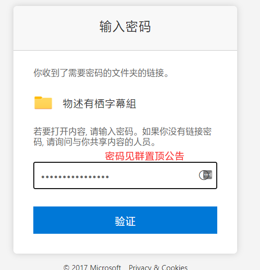
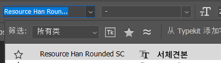
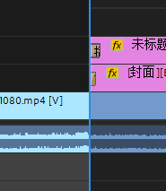

## 工作流程

### 视频版

[剪辑上传](https://player.bilibili.com/player.html?bvid=BV1sv411C73T&p=3&high_quality=1&as_wide=1&danmaku=0&autoplay=0 ':include :type=iframe allowfullscreen=true width=100% height=500px')

### 图文版

1. 【立项并接活】在工作表“项目名”列和子项目名列填上项目名和子项目名，然后在“剪辑”列填上填上你的名字。

2. 【打轴】在你的Pr（或其他软件）中进行剪辑。

3. 【导出并重命名】导出视频并按文件名规范重命名

4. 【上传1】在工作表点击项目名或子项目名上的链接，即打开项目/子项目文件夹后，上传ass

5. 【上传2】如果发现没有项目名和子项目名的链接，请先去OD自行创建文件夹，然后再上传ass

（示例是建立了子项目文件夹，但项目文件夹的建立也同理）

6. 【填写源信息】将剪辑视频的文件名填入“源”列，并在旁边写上视频时长

7. 【完工】将你工作表中自己的名字所在单元格涂蓝。

> [!TIP]
> - **视频文件名命名规范见“**[**剪辑视频文件名命名规范**](/handbook/project-management/file-naming-convention.md#视频文件名)**”。**
> - 关于“项目”和“子项目”的概念，见“[什么是项目和子项目？](/handbook/project-management/the-concept-of-project-and-subproject.md#什么是项目和子项目)”。
> - 工作表里的下载链接是由杂务插入的，你无需插入链接（也无法获得正确的链接）。

## 使用的软件

本组一般使用**Adobe Premiere**剪辑视频 。当然你也可以使用其他软件，但必须是无水印且可更改输出设置的软件。

组内提供Pr的下载：[破解版Adobe_Premiere_Pro_2020_14.0.0.571_SP_20191023](https://mononobealice-my.sharepoint.cn/:u:/g/personal/e307220930_mononobealice_partner_onmschina_cn/EU3Vkb3hVwtKsLSgo2GLLbIBu2mP4r8Rv6mKgA9UGs-4LA?e=R44uYM)

## 剪辑要求

通过Onedrive网盘获取源视频文件后，导入Pr，剪出要剪的片段，并在首尾加上OP、ED，然后将剪辑好的序列导出。

> [!ATTENTION]
> 序列帧速率（FPS）应与视频的**保持一致**。

### OP和ED的嵌入

目前在使用的OP、ED是：

- op1(音乐完整+Alpha通道).mov
- 【新ED（推荐）】三周年新ED_1920x1080.mp4
- 【旧ED】
   - ED_paryi版(720P).mp4
   - ED_paryi版(1080P).mp4

以上文件请去工作群文件里“OP和ED”文件夹里下载，或点击[此链接](https://mononobealice-my.sharepoint.cn/:f:/g/personal/e307220930_mononobealice_partner_onmschina_cn/EtnpsrW3tm9ChG429aBh3X0Bu65D2w89P67NdscSu9gKRQ?e=jG6lk4)前去下载（密码与组内OneDrive的进入密码一样，见群公告）。

> [!WARNING]
> - 当视频为比较安静的内容（如ASMR、深夜杂谈等），OP应改为无声。
> - 当视频开头就是歌时，可以将op本身的音乐去掉，衔接开头的歌声。（同理于ED）（仅建议，非必须）
> - 一般情况下使用的OP是“op1(音乐完整+Alpha通道).mov”，用法见下。如果有特殊需要时，选择无Alpha通道的。
> 
> - 注意ED有720P和1080P版本，请根据源视频的分辨率选择对应的ED。
> - OP和ED的音频增益应该调整到合适的量，并与视频内容保持相对平衡。

### 导出参数

- 导出设置的格式应为H.264。
- 比特率VBR2次，
   - 源为720P时：
      - 杂谈回目标3Mbps、最大6Mbps；
      - 游戏回目标4Mbps、最大8Mbps。
   - 源为1080P时：
      - 杂谈回目标4Mbps、最大8Mbps；
      - 游戏回目标5Mbps、最大10Mbps。
- 音频比特率320kbps，采样率48000Hz。

## ED插入推荐视频的跳转

新ED增加了推荐视频空位，在剪辑时可以在对应位置贴上封面，之后投稿时插入弹幕链接就能完成推荐视频的跳转了。

### 1. 登记

首先选择想要关联的视频，在备注中填写

在B站视频简介中找到剪辑日期，到OD中寻找封面，也可以用[bilibili封面提取](https://bilicover.magecorn.com/) 来获取封面 

### 2. 制作文字贴图 

打开文字贴图psd，选择竖排文字工具。

 

字体为图中内容Resource Han Rounded SC，在时轴教程中应该能找到。

 

点击psd文字中即可编辑，排版随意，整齐美观即可。

 

最后导出为png即可。

### 3. 嵌入ED视频 
将封面和文字贴图导入pr，拖到工作区里。封面应该很大，自行调整即可。

 

最好调整为上下边距之和为左边边距，文字贴图如下所示。

 

图片设置的时长为20秒左右，文字与图片同长 。

 

寻找插入的时间点，为ED开始后的第17秒，于此放入图片。

 

也可以先在ED左边的图片框已经固定时嵌入图片然后再重新播放ED ，大约在图中被圈住的两个的角对齐的时间点即为图片插入时间点。

 

关于特效，封面与文字图片时间轴右侧均为交叉溶解，左侧时间轴封面图片为交叉溶解，文字图片为插入，插入特效将时间拉长为原来的两倍即可。

 
 

### 4. 插入视频链接

此项由投稿人负责，剪辑不用负责。

最终效果如下：

 

## 小爱丽丝进度条（可选）

首先根据剪辑时长选择进度条时长

 
 

导入PR，因为其自带一条无声音频，拖拽时注意不要覆盖其他音频

 

剪掉进度条多余的部分

 

双击选中进度条轨道，在源中点击效果控件

 
 

首先不要着急设置关键帧，调整位置数值为 (6 , 1048.9)，此时进度条位置刚好在左下角

 
 

之后将PR的工作区的进度拉到视频最开始的位置，点击效果控件中位置部分左侧的秒表图标，设置第一个关键帧

 

最后将工作区的进度拉到视频结束的位置，记得在播放完的最后部分左移一帧，此时只需要调整位置的数值即可，不需要再次点击秒表图标，将位置数值调整为( 1924 , 1048.9)

 
 

进度条正好在右下角

 

之后按照往常的设置导出即可

进度条下载地址在OneDrive的素材和工具→剪辑→进度条中

