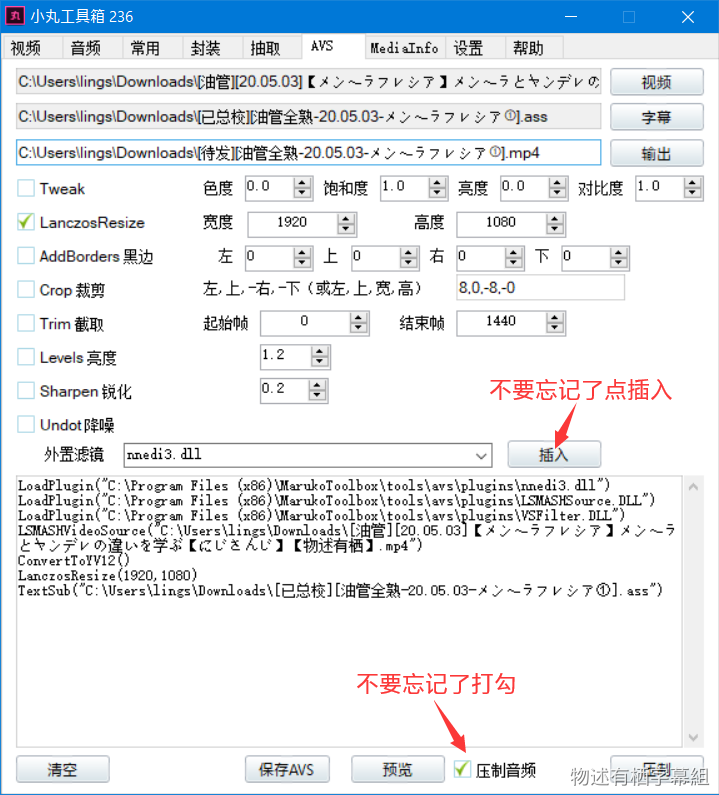
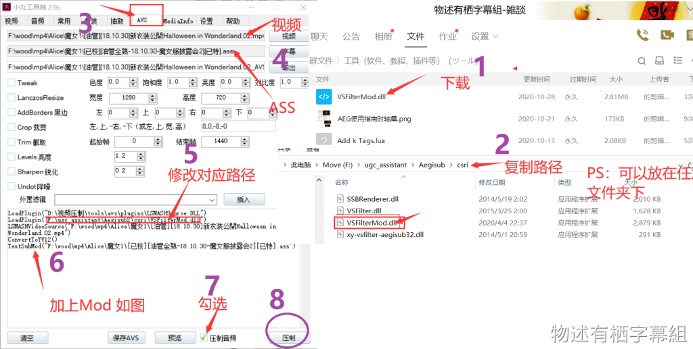
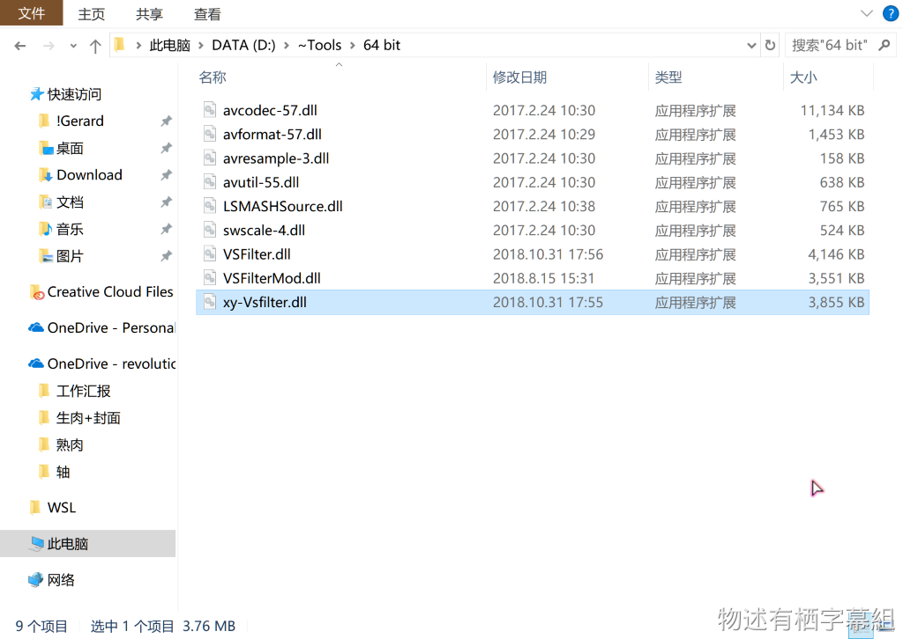
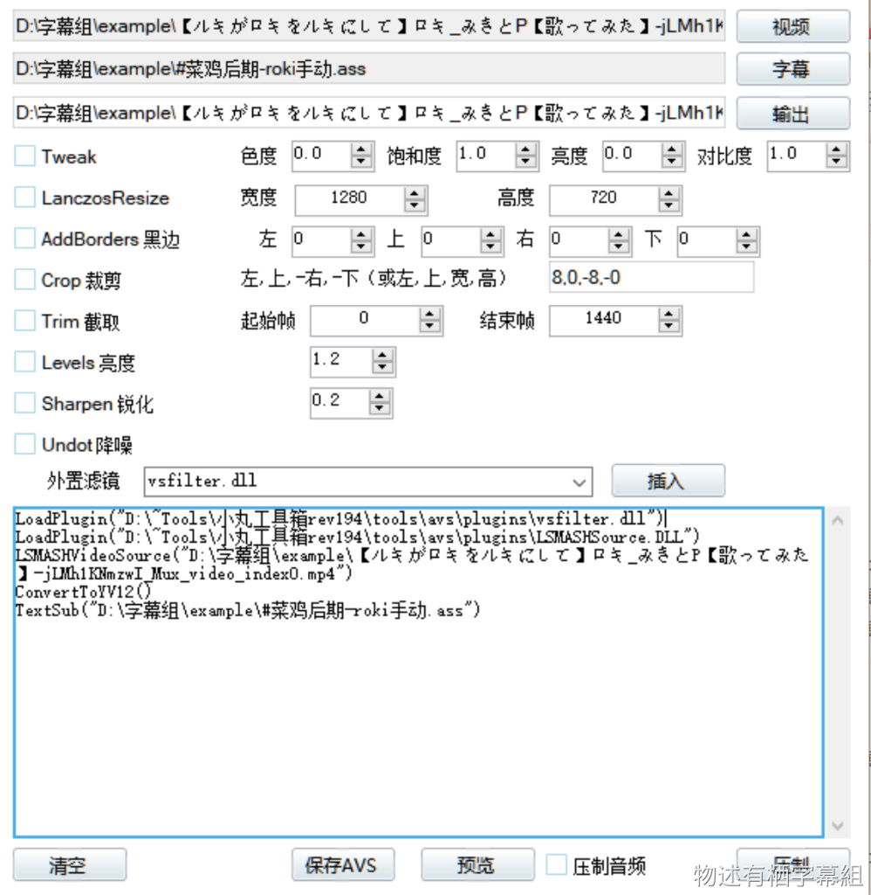
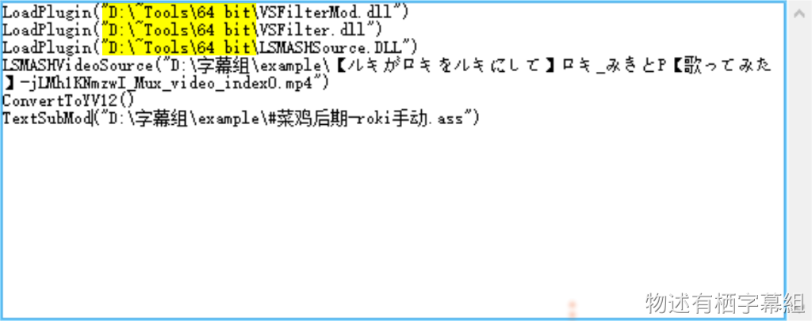
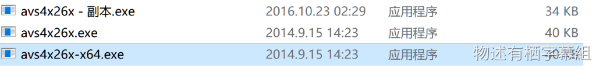
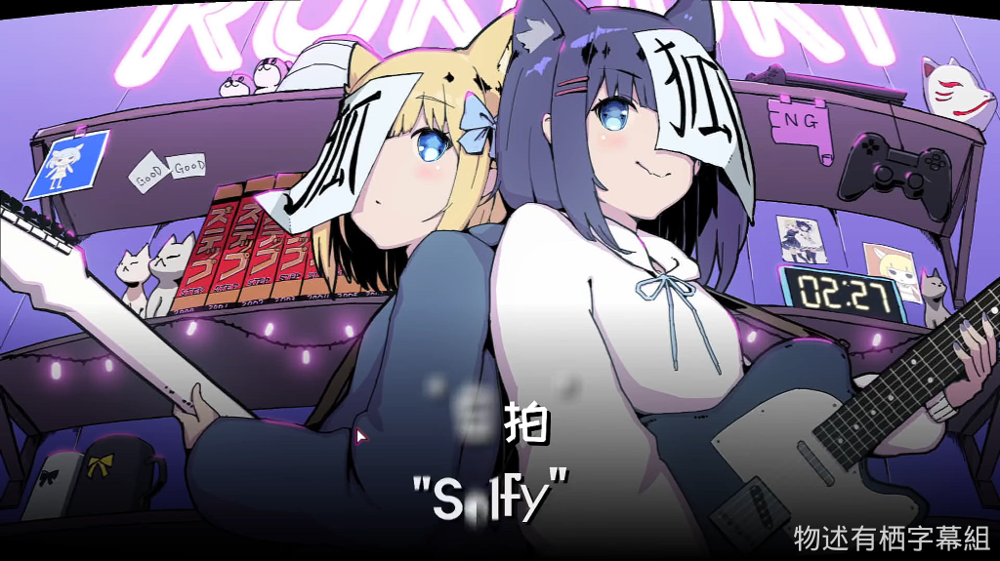
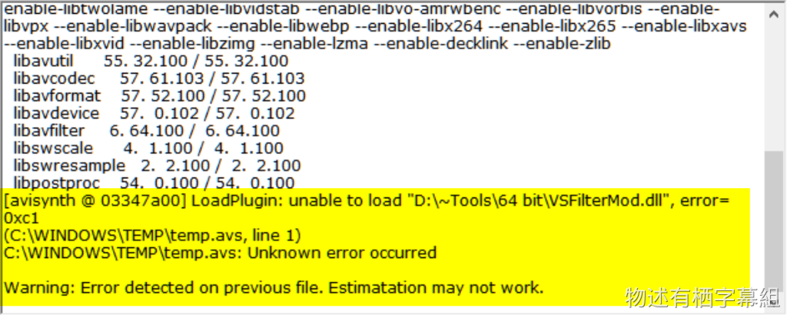

## 压制软件

组内常用小丸工具箱进行压制，除此之外还有[消极压制](https://github.com/zyzsdy/NegativeEncoder)、[ShanaEncode](https://github.com/1265578519/ShanaEncoder)等软件。

组内提供小丸工具箱的下载：[小丸工具箱236](https://mononobealice-my.sharepoint.cn/:u:/g/personal/e307220930_mononobealice_partner_onmschina_cn/EWdq7JyTfZdHnTkhqYnl6-gB7MtR-sVWVMum01f9hKtpqQ?e=lof3xq)

组内提供消极压制的下载：[NegativeEncoder_release_0.4.2_draft](https://mononobealice-my.sharepoint.cn/:u:/g/personal/e307220930_mononobealice_partner_onmschina_cn/EfZvOL3cw1xEv-UjTNcE66gB8VIo-wQSM3pYlDz_87oX4Q?e=RrixMx)

## 压制参数（以小丸为例）

※Resize是针对720P视频的，1080P视频无需。

## 如何使用64位的VSFilterMod进行压制  

准备： 
- 64位的VSFilterMod
- 64位的各种滤镜
- 小丸 
 
> 更多的滤镜，请看这里：[http://avisynth.nl/index.php/AviSynth%2B_x64_plugins](http://avisynth.nl/index.php/AviSynth%2B_x64_plugins)  

首先将压缩包里面的文件全部解压到一个文件夹里面 

 
然后切换到avs窗口 
然后插入视频和字幕文件 
我以ルキロキ的ロキ和黑兔大大的特效ass♂为例 

 
在外置滤镜处插入VSFilterMod  
然后将文件地址换成你刚刚解压出来的文件地址 
将TextSub换成TextSubMod 

 
手动把小丸工具箱Tools目录下的avs4x26x做个备份之后将avs4x26x-x64改名为avs4x26 

 
然后 按“压制” 

 
OK~~ 
PS:由于小丸的AviSynth比较垃圾，所以会出现这种错误提示，不慌，一点问题没有 

> 2019.3.30 
> 
> Gerardyang 

