## 工作流程

### 视频版

[轴翻校接活](https://player.bilibili.com/player.html?bvid=BV1sv411C73T&p=1&high_quality=1&as_wide=1&danmaku=0&autoplay=0 ':include :type=iframe allowfullscreen=true width=100% height=500px')

[轴翻校上传文件](https://player.bilibili.com/player.html?bvid=BV1sv411C73T&p=2&high_quality=1&as_wide=1&danmaku=0&autoplay=0 ':include :type=iframe allowfullscreen=true width=100% height=500px')

### 图文版

1. 【接活】在工作表“时轴”列对应项目的单元格上填上你的名字。

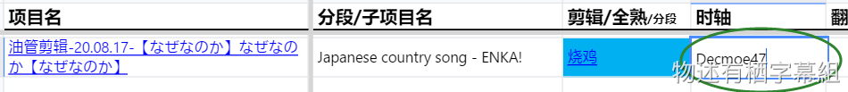 

2. 【下源】在“剪辑”列或“源”列点击链接下载源。

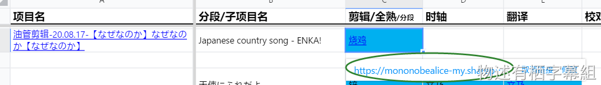  
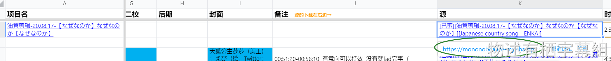  
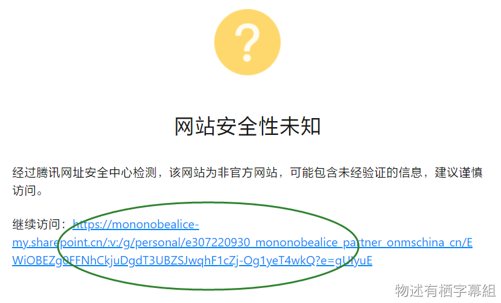  
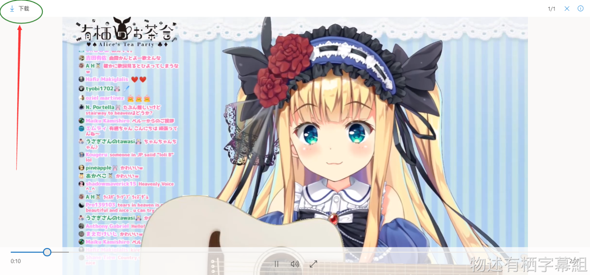 

3. 【打轴】打开你的Aegisub，开始打轴。 

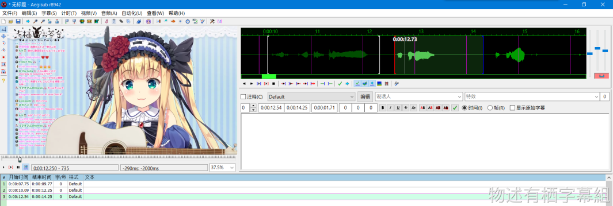 

4. 【保存并重命名】保存ass并按文件名规范重命名 

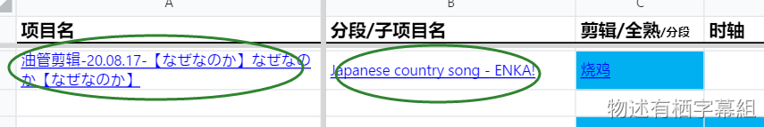 
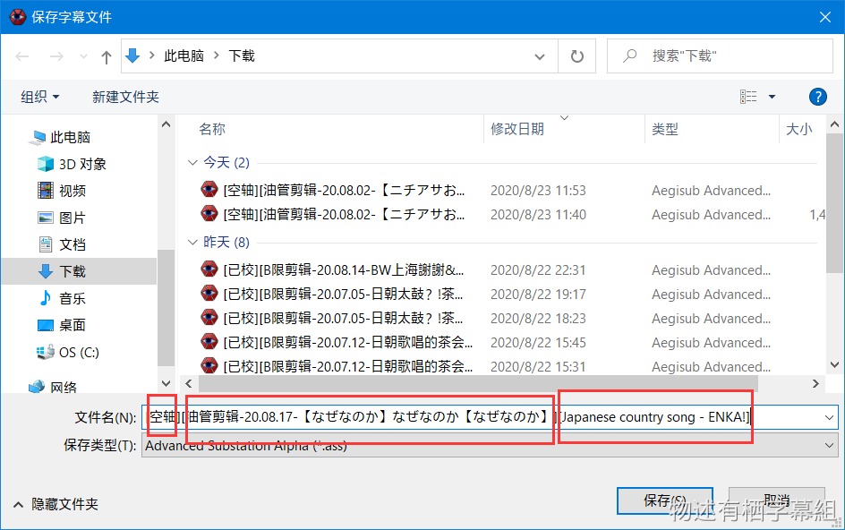

5. 【上传1】在工作表点击项目名或子项目名上的链接，即打开项目/子项目文件夹后，上传ass 

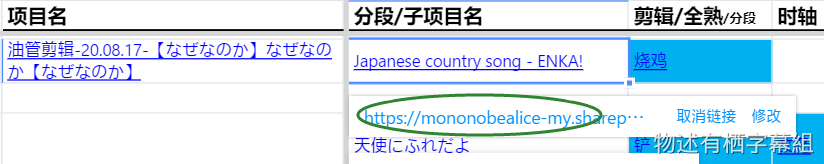 
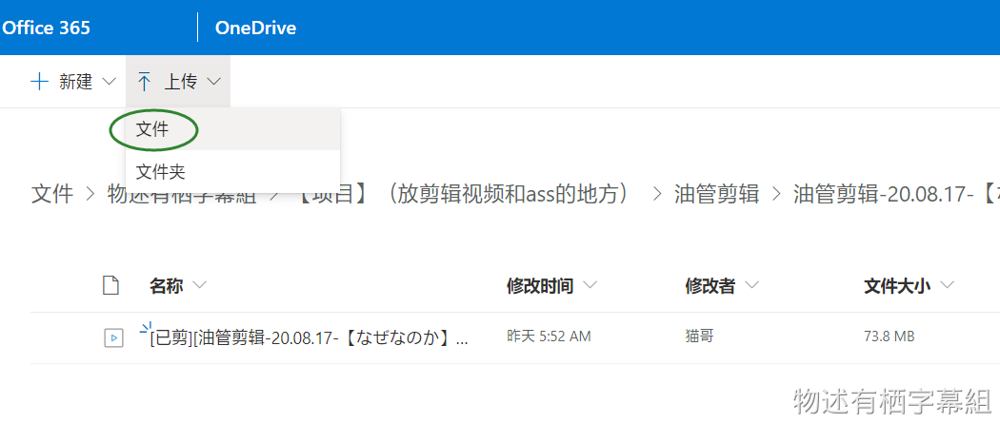

6. 【上传2】如果发现没有项目名和子项目名的链接，请先去OD自行创建文件夹，然后再上传ass （示例是建立了子项目文件夹，但项目文件夹的建立也同理）

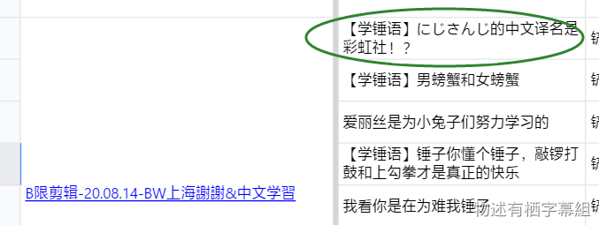 
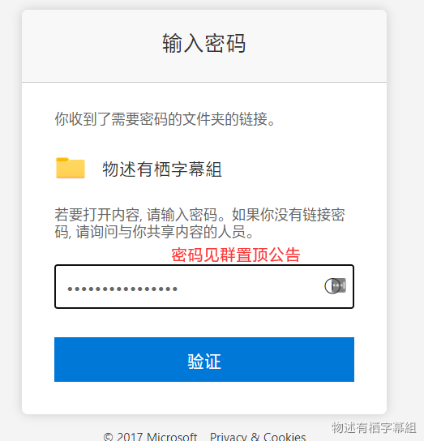 
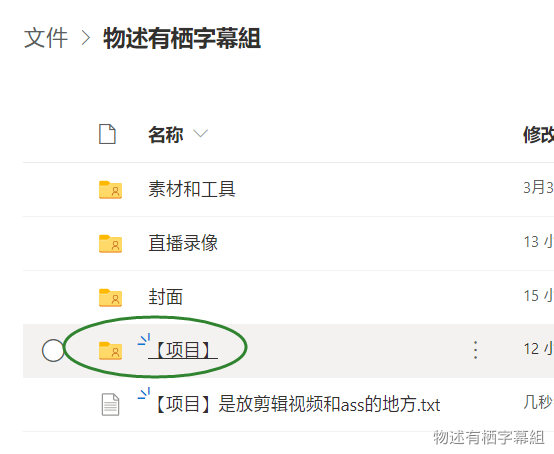 
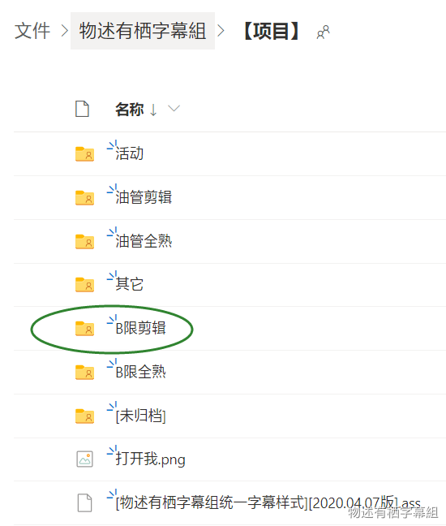 
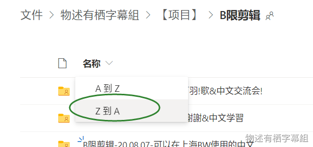 
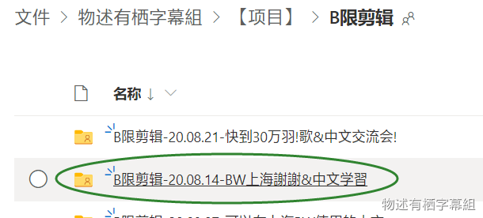 
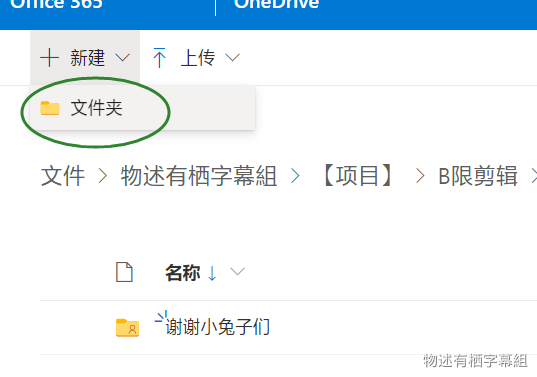 
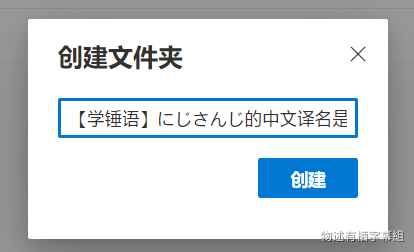 
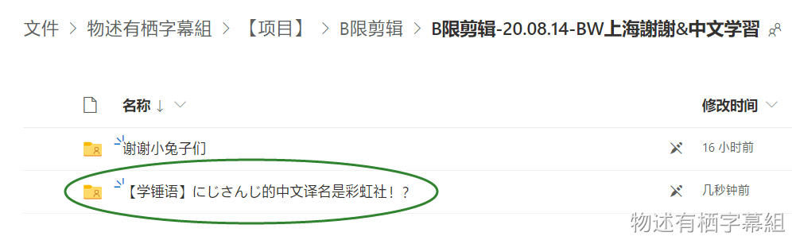 
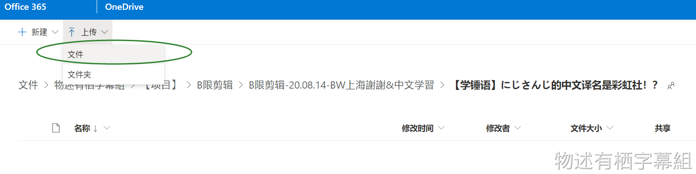 

7. 【完工】将你工作表中自己的名字所在单元格涂蓝。

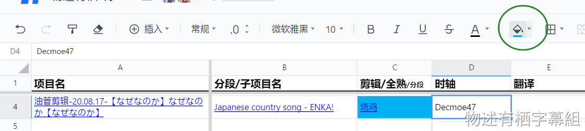 
 
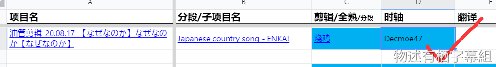 

> [!TIP]
> - **本组默认是先轴后翻。虽然允许先翻后轴的时轴man，但由于习惯先翻后轴的翻译man没几个，所以建议尽量还是先轴后翻。如果实在有有特别需要，请联系杂务。**
> - 你可能会看到工作表里的“分段”，意思就是你烤的部分是写的时长内，比如“40-60”就是让你烤视频第40分钟到第60分钟的部分。
> - **ass文件名命名规范见“**[**字幕文件名命名规范**](/handbook/project-management/file-naming-convention.md#字幕文件名)**”。**
> - 关于“项目”和“子项目”的概念，见“[什么是项目和子项目？](/handbook/project-management/the-concept-of-project-and-subproject.md#什么是项目和子项目)”。
> - 工作表里的下载链接是由杂务插入的，你无需插入链接（也无法获得正确的链接）。

## 使用的软件

本组一般使用**Aegisub**制作字幕。鉴于Arctime与Aegisub的ass文件有可能会发生兼容问题，所以非特殊情况请勿使用Arctime。

本组统一使用的Aegisub版本：[Aegisub Stereo](https://mononobealice-my.sharepoint.cn/:f:/g/personal/e307220930_mononobealice_partner_onmschina_cn/EslFpzn9WqxLsmuzcuXCT_AB7i0ZtVbPhP3XpqljES7B_A?e=4uQfeZ)（由组内大佬基于v3.3.2_win64魔改的双声道版）。

### 插件

组内上传了一些Aegisub常用的插件（脚本）供烤肉man使用，点击[此链接](https://mononobealice-my.sharepoint.cn/:f:/g/personal/e307220930_mononobealice_partner_onmschina_cn/EkpWhvuzzThFgk0DLCWNAPoBnzOQEOG045K1d2qU0-5WEA?e=Kx7FpG)打开文件夹。如果你有好的插件想分享给大家的，可以上传到群文件并@杂务。

## 字幕样式

请在开工前下载物述有栖字幕组的统一时轴样式（当前为“**[物述有栖字幕组统一字幕样式][2022.04.29版].ass**”），并复制到你的Aegisub样式库中，以便今后能够快速使用。

同时你需要下载统一字幕样式使用的字体“ResourceHanRounded-Medium.ttc”和“SourceHanSerif-Heavy.ttc（思源宋体 黑体）”，并安装到你的电脑上。

> [!WARNING]
> 思源宋体字体是包含了多语言的ttc版本，非单独中文版本。

以上提到的文件请从工作群群文件的“字幕样式和字体”文件夹中下载，或点击[此链接](https://mononobealice-my.sharepoint.cn/:f:/g/personal/e307220930_mononobealice_partner_onmschina_cn/Enc3fqCg3M5Anr0yF1h-Dk0BgcC068HxT9V2VOcZqz7x5g?e=RNG4Sx)前去下载（密码与进入OneDrive的密码一样，见群公告）。

时轴样式应根据该行的用途使用不同的统一时轴样式，具体如下：

### 统一字幕样式使用场景

> [!ATTENTION]
> 最新版统一字幕样式区分了720P和1080P对应的字幕样式，使用时应根据视频分辨率分别使用。

**统一时轴样式名** | **使用场景**
--- | ---
爱丽丝chat - CN | 默认的中文样式（见下图） 
爱丽丝chat - CN - 顶端 | 默认的中文顶端样式；要在视频里注释或翻译评论时用此样式（见下图）  
爱丽丝chat - CN - 有banner时 | 当视频底端有滚动条(banner)时，默认中文样式为此（见下图） 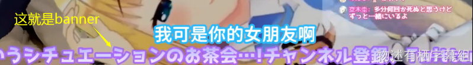
爱丽丝chat - CN - 注音{\\pos(x,639)} | 为字幕中的字词注音时，加上特效代码“{\\pos(x,639)}”，与样式“爱丽丝chat - CN”匹配。很少用到。
爱丽丝song - 随口 - JP | 随便唱几句时的歌词日文样式，使用时需要设为1层。
爱丽丝song - 随口 - CN | 随便唱几句时的歌词中文样式
爱丽丝song - 认真 - JP | 认真唱时默认的歌词日文样式
爱丽丝song - 认真 - CN | 认真唱时默认的歌词中文样式
爱丽丝song - INFO - 日语名 | 歌曲日语名的样式
爱丽丝song - INFO - 中文名 | 歌曲中文名的样式
爱丽丝song - INFO - 创作者 | 歌曲创作者的样式
兔幅chat - CN | 兔蝠的默认中文样式
兔蝠song - CN | 兔蝠的歌词中文样式
兔蝠song - JP | 兔蝠的歌词日文样式

## 时轴要求

- **一行的持续时间和长度**：每句话应前空50ms左右，后空200-500ms左右（视句子长短决定）。
- **以下情况要连接行**：
   - 两行之间间距过短（参考值为≤300ms，具体应根据字幕在视频里的显示情况调整）的话应考虑行首尾相连（上一行的结束时间与下一行的开始时间相同），避免出现“闪轴”情况（指两行轴之间由于间隔过短导致第二行轴一闪出现的情况）。
- **以下情况要合并行**：
   - 单句行最短500ms，否则就考虑合并行或后空。
- **以下情况要拆成两行/多行**：
   - 单独成句的笑声一般是不轴的。如果一句话中的笑声时间超过0.3s，则视为两句话，应拆成两行。
   - 同一屏幕上不能出现两行字幕。单行持续时间应控制在7s以内，长句应分行。
   - 歌词（包括清唱时的）和说话的内容须分为两行。
   - 不知道怎样断句的时候就拆分为连续的短行，即**宁短避长原则**。（方便翻校需要时合轴）
- 歌曲无歌词的话，如果前面没有说过歌名的话最好轴一下，因为顶上要注释这是什么曲子，判断不了的话轴上也行不轴也行，只补一下这个也比拆轴方便很多。
- ass脚本分辨率应该与源视频分辨率保持一致。例如源视频分辨率为1280*720的话，应检查脚本分辨率是否也为1280*720。具体操作方法是“文件→配置”中的分辨率栏。

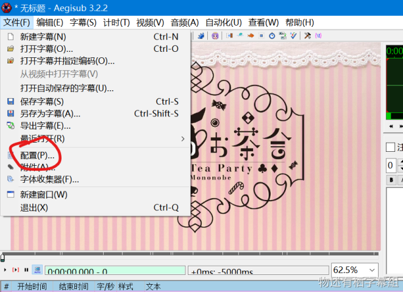
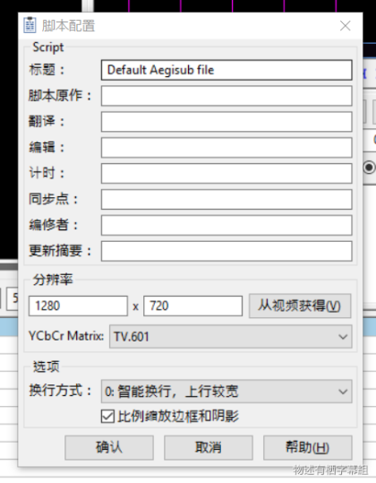

- 字幕样式应选择符合视频分辨率的样式。

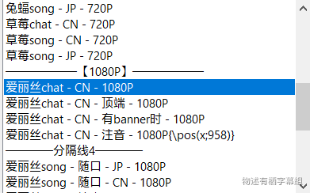

## 特效轴

由于爱丽丝经常唱歌，歌的剪辑也会很多。原则上特效轴自由创作，不强求，有想法就主动接即可，没想法就设淡入淡出效果即可。

关于特效轴的教程和资料，点击[此链接](https://mononobealice-my.sharepoint.cn/:f:/g/personal/e307220930_mononobealice_partner_onmschina_cn/Ej85eW8FRjpFqExRkeA-3aQBBtSP9RIYuI4RsxxcL7owow?e=zvJZik)打开汇总文件夹。
