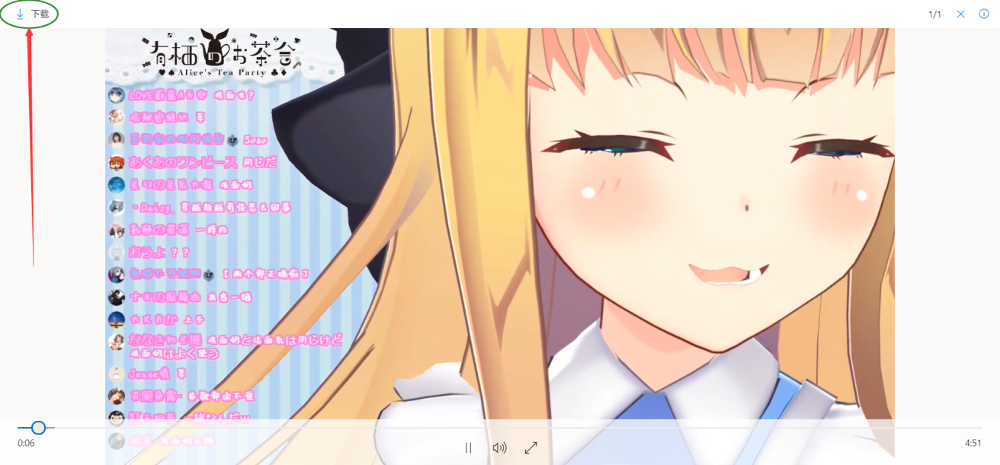
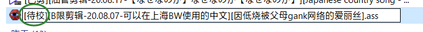
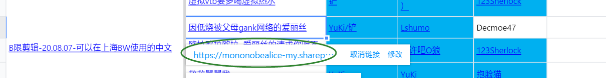
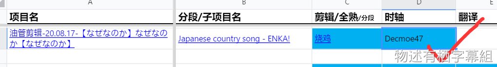

## 工作流程

### 视频版

[轴翻校接活](https://player.bilibili.com/player.html?bvid=BV1sv411C73T&p=1&high_quality=1&as_wide=1&danmaku=0&autoplay=0 ':include :type=iframe allowfullscreen=true width=100% height=500px')

[轴翻校上传文件](https://player.bilibili.com/player.html?bvid=BV1sv411C73T&p=2&high_quality=1&as_wide=1&danmaku=0&autoplay=0 ':include :type=iframe allowfullscreen=true width=100% height=500px')

### 图文版

1. 【接活】在工作表“翻译”/“校对”列对应项目的单元格上填上你的名字。

2. 【下源】在“剪辑”列或“源”列点击链接下载源。

3. 【下ass】点击你前面那位烤肉man的单元格上的链接，下载空轴/待校稿。

4. 【翻校】打开你的Aegisub，开始翻译/校对。

5. 【保存并重命名】保存ass并按文件名规范重命名

6. 【上传】在工作表点击项目名或子项目名上的链接，即打开项目/子项目文件夹后，上传ass

7. 【完工】将你工作表中自己的名字所在单元格涂蓝。

> [!TIP]
> - 你可能会看到工作表里的“分段”，意思就是你烤的部分是写的时长内，比如“40-60”就是让你烤视频第40分钟到第60分钟的部分。
> - **本组默认是先轴后翻。虽然允许先翻后轴的翻译man，但由于习惯先翻后轴的轴man没几个，所以建议尽量还是先轴后翻。如果实在有有特别需要，请联系杂务。**
> - **ass文件名命名规范见“**[**字幕文件名规范**](/handbook/project-management/file-naming-convention.md#字幕文件名)**”。**
> - 关于“项目”和“子项目”的概念，见“[什么是项目和子项目？](/handbook/project-management/the-concept-of-project-and-subproject.md#什么是项目和子项目)”。
> - 工作表里的下载链接是由杂务插入的，你无需插入链接（也无法获得正确的链接）。

## 使用的软件

本组一般使用**Aegisub**制作字幕。鉴于Arctime与Aegisub的ass文件有可能会发生兼容问题，所以非特殊情况请勿使用Arctime。

本组统一使用的Aegisub版本：[Aegisub Stereo](https://mononobealice-my.sharepoint.cn/:f:/g/personal/e307220930_mononobealice_partner_onmschina_cn/EslFpzn9WqxLsmuzcuXCT_AB7i0ZtVbPhP3XpqljES7B_A?e=4uQfeZ)（由组内大佬基于v3.3.2_win64魔改的双声道版）。

### 推荐的辅助软件

自动打轴机“[DD烤肉机](https://github.com/zhimingshenjun/DD_KaoRou2)”可以进行自动打轴，其精准度目前还无法完全替代轴man，但在没有轴man的情况下可以使用它来减少工作。此外它还支持降噪、分析生成人声音轨、倍速播放等功能，对于翻译和校对时也会有帮助。

组内提供的下载：[DD烤肉机v2.0.2_beta](https://mononobealice-my.sharepoint.cn/:f:/g/personal/e307220930_mononobealice_partner_onmschina_cn/Egd5vqkmGk9DhSzA0sxDgX4BXTRB3i0hcSc52845zcqtRw?e=UHIzdA)

官方使用教程视频：[【轴man救星】DD烤肉机2.0版 正式发布！！附带保姆级使用教程](https://www.bilibili.com/video/BV1p5411b7o7)

## 翻译要求

### 标点符号

符号名 | 符号 | 说明
--- | --- | ---
省略号 | … | 中文输入法下shift+6得到“……”后再退格一下就是“…” ※注意不是三个英文句点“...”，更不是三个中文句号“。。。”！
问号** | ？ | 全角问号（中文/日文的问号），若句子的疑问语气足够的话，不必加上问号。
空格 |   | 句子之间的分隔不用逗号和句号，用两个英文空格（两个半角空格）分开。（左为明显显示而加的背景色，并不代表空格包含背景色） 
引号 | 「」 | 直角引号（日文的引号），用于引用（如爱丽丝读到的评论、台词、特殊名词等），或作品名时 
二级引号 | 『』 | 直角厚引号（日文的二重引号），用于引号内的再次引用，或作品名内的二级引号
波浪号 | ～ | 全角波浪号，除需要强调语气的地方外应尽量避免使用
感叹号 | ！ | 全角感叹号（中文/日文的感叹号），除需要强调语气的地方外应尽量避免使用

> [!ATTENTION]
> 除此以外的标点符号不应该出现在翻译稿中（歌词视情况）。

### 语气词

- 一般情况下，笑声不需要标识，比如像“www”“2333”之类的都不用。
- 注意一下语气词的用法，不要让整句翻译太生硬。

### 遇到梗或或评论时

- 遇到梗时请善用搜索引擎查询并注明，或者尝试问问群里的人。
- 如果某梗有必要解释给观众，将用于解释该梗的一行的时轴样式设为“爱丽丝CN - 顶端”，并在句子开头加上“* ”以表示此为注释（这里指对原文内容的解释，不是Aegisub的注释功能），见下图。

> [!TIP]
> 更多关于时轴样式的使用场景见“[统一字幕样式使用场景](/handbook/guideline/timeline.md#统一字幕样式使用场景)”

### 翻译评论时

- 如果这是爱丽丝读出来的，使用“爱丽丝CN”/“爱丽丝CN - banner”时轴样式，并允许与其他说话的内容在一行内。（见下图）

- 如果并未读出来但你觉得需要翻译出来的，使用“爱丽丝CN - 顶端”时轴样式，并单独成一行，且要在开头写上“弹幕：”（B限）或“评论：”（油管）。

- 无论哪种，评论内容本身都应用「」括起来。（如上图，如果评论内容里本身就有引号，就用『』这个括起来）

> [!TIP]
> 更多关于时轴样式的使用场景见“[统一字幕样式使用场景](/handbook/guideline/timeline.md#统一字幕样式使用场景)”

### 专有名词统一翻译表

原名 | 译名 | 备注
--- | --- | ---
うしねずみ／うしねじゅ | 牛鼠 | 爱丽丝的宠物猫 
まる | 圆圆 | 牛鼠之一
ボス | 老大 | 牛鼠之一
ホワイティ | 小白 | 牛鼠之一
ポチ | 波奇 | 牛鼠之一
ごちごち | 莓莓 | 爱丽丝对宇志海莓的亲昵称呼
うさもり | 兔蝠 | 爱丽丝旁边飘(跳)着的生物 
イキリボン | 嚣张缎带 | 
ぱぱのべ | 物述爸爸 | 
ままのべ | 物述妈妈 | 
うさぎさん | 小兔子 | 
有栖／ありす／アリス | 爱丽丝 | 即只有名字出现时用 
物述有栖 | 物述有栖 | 
メンバー | 会员（油管直播时）/舰长（B限直播时） 
物述ありお | 物述有冈 | 曾经爱丽丝玩gal时取的男主名
ニチアサ | 周日早茶会 | 
アリストロベリー | 爱丽丝草莓 | 爱丽丝与宇志海莓的组合名

> [!TIP]
> 如果想要添加条目，请联系组内杂务。
