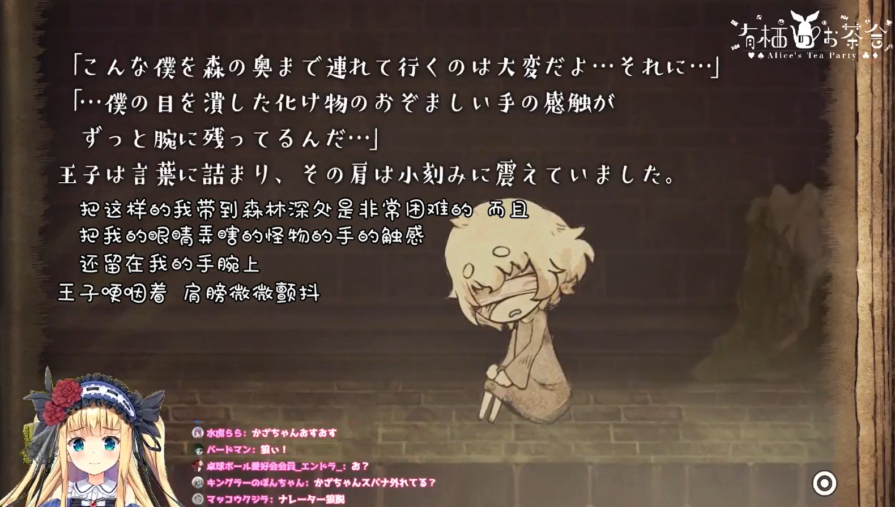

2021年5月22日，物述有栖字幕组迎来了建组三周年纪念日。三周年之际，本专栏将与你一起回顾爱丽丝组的历史，了解曾经各种因缘趣事，以及大家一路走来的心路历程。

事不宜迟，让我们马上进入正题吧。

## 第一任组长（2018.5~2018.6）：

### 建组前（2018.3~2018.5）

那是一个没有风雨交加，也没有电闪雷鸣的夜晚，azu决定要搬运和翻译爱丽丝的视频。那时的他，还没有想过建立字幕组，只是一个人自己翻译，只是用自己的个人号进行了投稿。

是什么促使他走上搬运翻译这条不见底不赚钱的用爱发电之路呢？

azu坦言，在当初，因为看到东云惠等Vtuber入驻Bilibili之后，非常羡慕Vtuber也可以借助入驻账号和观众们互动的感觉，也想让（自己喜欢的）其他日本Vtuber也入驻进来。

但是，他四处奔走，却频频碰壁。当时的很多Vtuber的运营方，都对入驻Bilibili这件事保持保守观望的态度，并不愿意轻易踏入。

绝望中的azu，意外的看到了彩虹社（Nijisanji）的二创条例，认为对视频进行翻译也属于二次创作的允许范围内。于是，怀揣着一份热心的azu，怀着想把爱丽丝展现给更多人看的心情，开始了一个人的翻译生涯。

之后，azu也顺利得到了彩虹社的搬运授权。

### 建组后（2018.5~2018.6）

这时候，有另一个男人走来。

那就是mafuyu。

mafuyu主动过来询问，问azu是否需要更多的帮助。azu接受了。

于是本来独自一人的azu有了同伴，可以说，这正是后来字幕组的雏形。虽然这只是两个包含热情的少年，尚未能真正的说是一个正规的字幕组。

然而，事情并不是那么一帆风顺。字幕组初期，视频翻译的所有工作，基本都由azu一个人负责，mafuyu基本没有插手的地步。但是由于azu幼年渡日，中文并不是很好，所以有时azu翻译完成后，其他人会帮忙润色中文译稿。

这就是字幕组的最初：一条龙，几个润色工具人。

早期熟肉：[【生气了？】萝莉的傲娇是这样的！【爱丽丝流#1】](https://www.bilibili.com/video/BV1Gs411571y)

## 第二任组长（2018.7~2019.5）

### 交接时的情况

azu的学业问题临近了。

为了准备大学的入学考试，azu开始忙碌了起来。于是，azu便把字幕组的工作，交给了mafuyu。这时的mafuyu，还以为只是临时当代理组长一会，等到azu忙完学业之后便会回来接手。哪曾想，这一当，就当了一年。

那个当初热心勤奋的azu，一考完试，便跑到mea那边烤肉去了，却是后话。

azu走了之后，原先搬运工作的核心不复存在。面临着组无法继续运转的困境，mafuyu所做的第一件事，就是招人。为了扩散招人信息，mafuyu还找到了akari组等字幕组请求帮忙转发。

此刻，mafuyu做的，正是把之前依靠个人的翻译工作，转为通过分配工作、团队协调来运作的翻译小组。随着搬运组变得有组织性，这个时候，才称得上是真正意义上的字幕组的出现。

### 艰难而漫长的平稳期

刚开始招人其实很成功，爱丽丝组一度翻译数量比时轴多，能有翻译man这么充足的组，在那个时代还是挺少见的。这包括了到处拉人，比如斑比就是mafuyu从svc组那边拉过来的。当然也有过把爱丽丝组的翻译校对拉去别的组干活。

说到这个时期进来的组员们，其中一个就是键山。

键山是看到mafuyu发的招人动态，才意识到组里缺人的这件事，正好当时自己在公司里比较闲，就进来试试。一进来发现，原来azu和mafuyu都只是高中生而已，对于核心成员的年轻觉得挺诧异的。

键山进来后，经常一个人承担了所有翻译的校对工作，因此也没留多少活给mafuyu去干。再加上mafuyu自己比较的D，所以基本只是在和其他组做外交，或者干一些杂务，很少干其他的活。那个时候都是做的剪辑熟肉，但是组里能去看直播找切割点的人基本上只有键山一个，然后键山就下班路上边看边找，有了他的剪辑点后面的翻译流程才能成立。

除此之外，还有像是斑比等一些人干活最为勤奋，在哪艰难的时期撑起了整个组，在大部分组员不够活跃、而且十分缺人的情况下，保证了组的运转。

### 当了没几天后被“夺回”的新组长

值得一提的是，mafuyu有一段时间因为学业繁忙的缘故，接下来很长一段时间无法再顾及组内事务。于是他任命了建组初期的元老组员之一 肝 来担任下一任组长。任命之后，mafuyu就消失了。结果没过两天，肝才刚要开始适应组长的职务时，mafuyu突然诈尸，表示放心不下组，还是想继续当下去。肝只好把组长职位还了回去。

### 三龙同传

有一次直播，azu与键山、神坂空商量，尝试通过Google docs进行三人同传，你一句我一句的接下去，基本没有一句遗漏。（当初直播是文字冒险游戏，所以还需要翻译游戏内文本）这可以说是字幕组同传里极为豪华的同传阵容了。之后组里利用同传文本打轴，很快的出了熟肉。

[（被三人同传的直播，在后来烤出来的熟肉）](https://www.bilibili.com/video/BV1YW411174X)

### 在学习中成长

在当时，组内的大部分人，包括组长，都缺乏相关的技术的经验，都是技术力弱的。大家一边工作，一边学习，不断的在学习中成长起来。组内技术力强的人教技术力弱的人，前辈教后辈，这样一代代言传身教，也算是字幕组的一贯传统。

就比如说mafuyu，当时就曾四处取经，向一些组的组长请教了打轴、特效轴等技能。

反过来，像scrpr等组里技术力强的人，也教会了大家如何去打轴、剪辑、压制、转播等。

### 工作规范化

随着人员的增加，工作标准的确立和统一便成了至关重要的问题。

这个时候，scrpr发起并持续维护了组内第一个工作规范。像是翻译规范、时轴规范等等的内容，为组员确立了统一的工作标准。

此外，他还自费提供了OneDrive网盘（OneDrive for Business 世纪互联版）作为字幕组的视频文件保存网盘，彻底摆脱了恼人的百度网盘带来的诸多问题，爱丽丝组也沿用至今。

可以说，他是组内工作规范化的先行者和奠基人。

### 或许是组长育成所？

令人惊奇的是，当时在组里的一些人后来都出去做别的组的组长了。可以说当时的爱丽丝组真的是人才辈出。

比如：

### 题外话：mafuyu的女装

mafuyu的女装其实是在进字幕组之前就开始了。一是因为本身体型比较适合，二是认为能通过这种方式调节组里的气氛也挺好的。高中的时候女装比较多，因为能藏到妹妹那儿（女装都是妹妹帮忙摄影的）；但到了大学之后就不行了，所以就很少女装了。

在组10万粉纪念直播上半场结束后的中场休息时间公布了mafuyu的女装照，引得众人惊叹。值得一提的是，这次也被爱丽丝看到了。

在被爱丽丝看到女装前的mafuyu：

在被爱丽丝看到女装后的mafuyu：

能被爱丽丝认可是JK，可是件好事啊（）

## 第三任组长（2019.6~2019.7）

### 交接时的情况

正可以是说历史的重现。当初azu因为学业问题将组长移交给了mafuyu，此刻，意外受任组长一年之长的mafuyu，为了准备大学的考试（以及自己比较D），就把组长的位置，转给了能干的键山。

这几乎可以说是一个必然的选择，因为在当时的组内，活跃的键山承担了组内的大部分工作，可以说和组长无异了。

### 爱丽丝开始关注字幕组

在很早的时候，爱丽丝就已经知道了在B站的字幕组在翻译自己的视频，并表示很高兴。（以下是当时提及时的视频剪辑）

（早期熟肉：[在直播中提到中国观众和b站的爱丽丝酱！(很短)](https://www.bilibili.com/video/BV15W411c7p5)）

有一次台词回，键山跟国内小兔子征集台词之后翻译成日语发到推特上，然后爱丽丝还回应了。

[当时征集的情况](https://h.bilibili.com/20036748)

（后来在直播里念出来的：[【熟肉】在玩游戏的时候暴露自己真实年龄的爱丽丝](https://www.bilibili.com/video/BV1Z4411t7Fy)）

### 爱丽丝入驻B站

2019年7月，彩虹社成员入驻B站前夕的时候，一开始成员里面是没有爱丽丝的，结果后来爱丽丝来了，让组员们都吓了一大跳。不过组并没有因为受惊吓而停下脚步，依然一如既往的努力烤肉，只不过从此增加了B限熟肉这一工作。

### 与日本小兔子交流的增加

键山知道日本小兔子经常使用推特后，也弄了一个推特的组号（最开始是日茗申请的账号）。看到推特上有不少日本小兔子说不会用B站，看不了爱丽丝的B限后，他觉得很难受，就整理了B站大致的使用方法发到推特上。在那之后，越来越多的日本小兔子来到了B限里，让他感到十分欣慰。

当时他还看到推特上一日本小兔子よし做的爱丽丝MMD视频特别好，询问他能不能搬到B站来，结果经过一番交流后键山干脆帮他弄了一个B站账号。（[よし的B站账号](https://space.bilibili.com/411983216)）像这样帮助日本小兔子注册B站账号也有过好几次了。

## 第四任组长（2019.8~今）

### 交接时的情况

后来键山由于公司里忙起来，没时间干活了，就把组给了猫哥。猫哥在8月份之前就已经是主力烤肉人物了，只是经常跑去烤gibara，所以在猫哥当时个人事务结束后，键山为了防止猫哥逃跑，果断把组长甩给了猫哥。（虽然公司加班也是事实）

### B限激光烤肉

一开始爱丽丝B限频率很低，每次播的时间也少，猫哥觉得剪辑出来也挺麻烦，于是经常全熟。后来B限频率上升，每次播的时间从1个小时到2、3个小时，全熟不再是那么容易承受得起的事，所以转为了以剪辑为主。这既是好事，也是辛苦事。

### 吃日本小兔子进组

当时键山哥联系比较多的是よし，而猫哥自己上推之后碰见的是紅天狗茸（べにてん）。然后和紅天狗茸聊的比较好，就问他要不要来组里的QQ群。猫哥告诉了他注册的方法，但是日本那边注册QQ的话手机总是接不到验证码，搞了半天终于解决后紅天狗茸成功进入了组的群。

和紅天狗茸一起进来的还有けんご。但是けんごさん比较忙，很少露面。之后又来了一个AH。所以现在组里其实是有三个日本兔。

### 工作流与项目管理的完善

2020年2月，组员Decmoe47就任“杂务”。为了整治组内杂乱的文件与项目管理情况，他首先将工作规范制定出来，然后向全组推广。前期并没有很多人知道这回事，或者说没有在意这回事，因此Decmoe47坚持监督组员有没有遵守工作规范，一个一个去找他们，向他们介绍工作规范，纠正他们的问题。当时，光是完善工作规范，就花了三个月。而推广花的时间更久。后来，认同的人越来越多，他们也加入到监督其他组员的队伍中。至今，工作规范已在组内全面普及。

关于字幕组工作流的介绍，可以移步至[https://www.bilibili.com/read/cv7575150](https://www.bilibili.com/read/cv7575150)阅读。

### 200人大组

2021年，字幕组主群达到了200名成员。当然，实际干活的并没有这么多（）。

### 与花寄组的外交（指互相吃人）

2020年8月8日，爱丽丝与鹿乃进行了联动。爱丽丝组与花寄组商量过后，决定联合烤肉，烤出全熟。于是猫哥新建了爱丽丝组与花寄组联合烤肉群。在群里，双方烤肉man意外的相投，除了聊到爱丽丝与鹿乃的事之外，还聊到了烤肉的日常等家常话。当提到各自都人手不足时，突然间，有人提出要互相交换烤肉man。于是乎，花寄组几位翻译man和校对man就进入了爱丽丝组，爱丽丝组几位轴man和翻译man也进入了花寄组。

### 3小时直播的激光

2020年7月24日，爱丽丝直播入驻B站一周年纪念，爱丽丝组也将这长达3小时的直播激光了。这对于爱丽丝组来说是史无前例的艰巨项目。这次直播召集了14名翻译man，12名轴man，9名校对man。由于是第一次面对3小时之长的激光，组内决定大胆创新分段实时烤肉方式，期间问题不断，但也一一克服了下来，最终于第二天成功投稿，完成激光。

## 结语

光阴似箭，岁月如梭。希望小兔子越来越多。物述有栖字幕组的发展，离不开大家的支持，希望大家踊跃加入烤肉。

---

主编：Decmoe47

日文翻译：IanoInfero

润色：天狐公主莎莎

监修：猫哥

物述有栖字幕组

2021年5月29日

