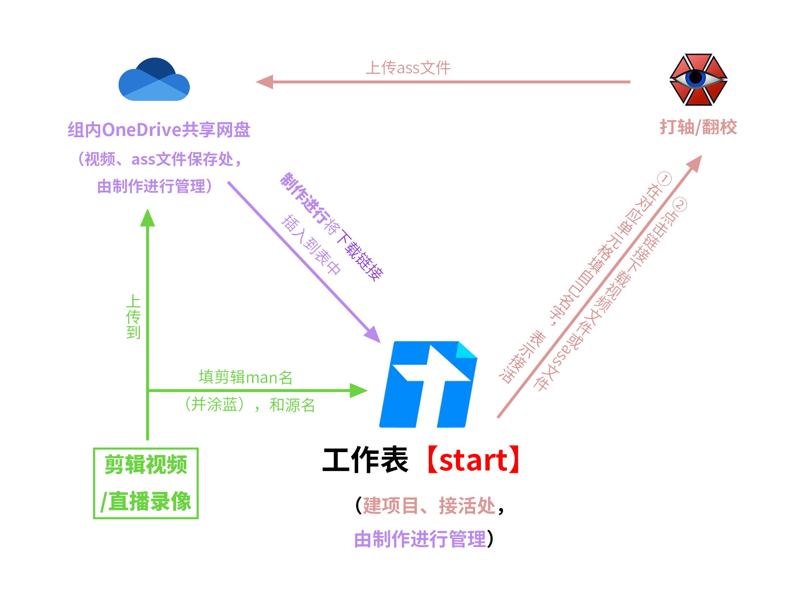

初来乍到爱丽丝组，或许一时难以了解爱丽丝组内部具体是什么情况。在此文档中你将会了解到爱丽丝组的一些信息，帮助你快速融入爱丽丝组。

## 爱丽丝组名片

“物述有栖”是日本ANYCOLOR株式会社旗下的NIJISANJI Project所属的虚拟主播（VTuber）艺人。

“物述有栖字幕组”（简称“爱丽丝组”）作为线上社团性质的官方合作字幕组，由粉丝自愿发起组织，志愿为物述有栖在中国哔哩哔哩视频网站开展活动提供翻译、字幕制作、转播等支援工作。现已投稿600多个已翻译的视频，官方帐号粉丝数将近40万，字幕组帐号粉丝数将近13万；总计播放量超过2800万，获赞数超过800万（官号+组号）。（截止到2021年9月8日）

附：

1. 物述有栖哔哩哔哩官方账号：[https://space.bilibili.com/434565011](https://space.bilibili.com/434565011)
2. 物述有栖字幕组哔哩哔哩账号：[https://space.bilibili.com/203365648](https://space.bilibili.com/203365648)
3. NIJISANJI中国官方运营：[https://space.bilibili.com/410484677](https://space.bilibili.com/410484677)

## 下属二级组

对应群 | 备注
--- | --- 
物述有栖字幕組-雑談（简称**杂谈群**） | 聊天闲谈用的地方，也是组内所有人员集合的地方。（所有人必加的群）
物述有栖字幕組-仕事（简称**工作群**） | 字幕制作（日→中）的讨论和进行的部门，是中翻的转播、扒源、剪辑、时轴、翻译、校对、后期(特效轴)、压制、杂务专门工作的地方。此外还是转推翻译的地方。
物述有栖美术室（简称**美术室**） | 封面、PV等的讨论和制作的部门，是画师、美工、后期(Ae特效)、调音等专门工作的地方。

> [!TIP]
> 新来的人若未加入杂谈群、工作群或美术室群（仅针对画师、美工、后期、调音、MMD制作man开放）的，向猫哥或日茗提出申请即可。

> [!ATTENTION]
> 进入组后，请在[《爱丽丝组职能表》](https://docs.qq.com/sheet/DQ0FDZnRacWF0SU15)中登记你的职能以及空闲时间（可根据实际情况随时更改你的空闲信息以告诉杂务你最近是否有空）。

## 字幕制作（烤肉）工作流

> [!NOTE]
> 爱丽丝组鼓励主动接活，偶尔会有安排烤肉。此外一般情况下不设deadline。

## 特殊职位

请参见 [特殊职位表](https://docs.qq.com/sheet/DSmduYUZlWXlwZW5R?tab=9i8hx6) 和 [特殊职务表](https://docs.qq.com/sheet/DSmduYUZlWXlwZW5R?tab=269v35) 。

