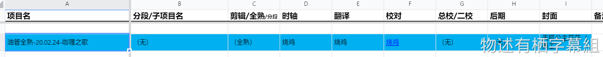
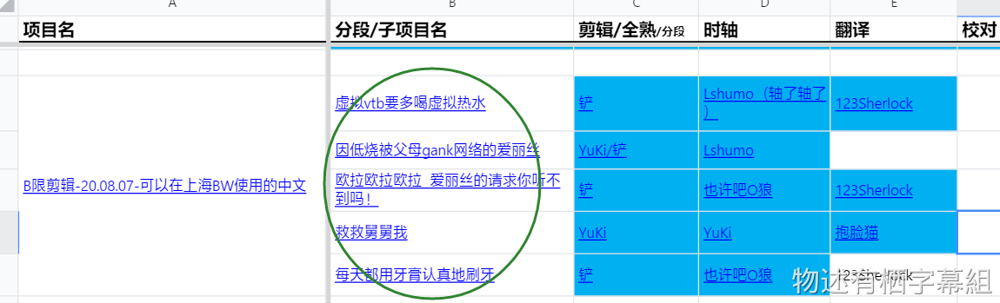

## 什么是项目和子项目？

一次直播，有可能是全熟，但也有可能是剪辑熟肉。而往往一次直播能剪出好几个剪辑。所以在此定义，**一次直播**是**一个项目**，**一个剪辑**是**一个子项目**。子项目从属于项目，自然一个项目下就能有一或多个子项目了。当然也有可能是零个子项目，这通常是全熟的时候，也有可能是单个视频（不是直播）的时候。

这个项目原本的源就是一个爱丽丝发在油管的视频，而非直播。[点此查看熟肉](https://www.bilibili.com/video/av91768469)。

> [!WARNING]
> 如果遇到全熟了的直播还需要剪辑的，应再单独新建一个剪辑项目。

项目和子项目的概念导入有助于管理视频和字幕文件，更重要的是能一目了然一次直播烤了哪些剪辑，对于统计和了解烤肉情况（比如撞不撞车）极有帮助。

> [!NOTE]
> 有时你会在工作表中看到类似“0-10”“120-140”这样的“**分段**”，为了分工合作，它通常出现在全熟项目中，但也同样可以出现在剪辑项目中。这意味着是否可以存在分段与项目类型无关。
> 

## 项目名的组成

由以下4个固定格组成：

**直播平台+项目类型-直播日期-主题名**

具体说明如下：

要素 | 说明 | 是否必写
--- | --- | ---
直播平台 | 从“油管”“B限”“活动”“其它”中选择一个。 | 必须 
项目类型 | 从“全熟”“剪辑”中选择一个。 | 必须 
直播日期 | 格式是“yy.MM.dd”（年.月.日.）。指直播开始或者视频上传的日期。特别地，如果是混剪项目，这一格直接写“混剪”，相对地，请在工作表备注栏里尽量写明用到的直播的日期。 | 必须 
主题名 | 对此项目的高度概括，通常是一些关键词。如果想不出来，可以从直播类型（杂谈、游戏等）、直播时间段（晚上等）等方面考虑。 | 必须 

举例：

- B限全熟-20.02.02-早茶会歌回
- 油管剪辑-混剪-贝斯晨练1~8
- 其他-21.01.07-手书搬运

> [!ATTENTION]
> - 主题名应由立项人取名，**尽量从短；严禁直接复制直播标题！一旦写在工作表里了就不能随便更改，即使要更改也请告知杂务。**
> - **子项目名≠投稿标题。子项目名应该遵从简短、易书写、易分辨的原则。要想写投稿标题的请写到工作表的备注列中。**
> - 主题名中请勿添加英文连字符“-”，请勿添加emoji。
> - 所有项目名中的连字符是英文的连字符“-”，请勿与中文的连接号“—”、破折号“——”搞混，更不要使用波浪线“~”。
> - **直播日期必须是`yy.MM.dd`的格式，不可多不可少，点“.”不能换成连字符“-”。**

## 子项目名的组成

子项目名基本等于剪辑视频名。但是它绝不等于投稿标题名。子项目名的作用是让人快速准确的了解此视频的内容，因此要尽量简短精炼。

> [!TIP]
> 关于投稿标题名的想法，请写在工作表“备注”列中。例如：
> 

## 子项目类型

子项目类型一共有5类，分别是：

- 短视频：30秒以下，通常10秒左右，投稿到官号/组号动态小视频，没有校对；
- 粗剪：1~3分钟，投稿到组号视频，没有校对；
- 精剪：1~5分钟，投稿到官号视频；
- 锦集：5~10分钟，通常为混剪，投稿到官号视频；
- 全熟：不剪辑的完整烤肉。

