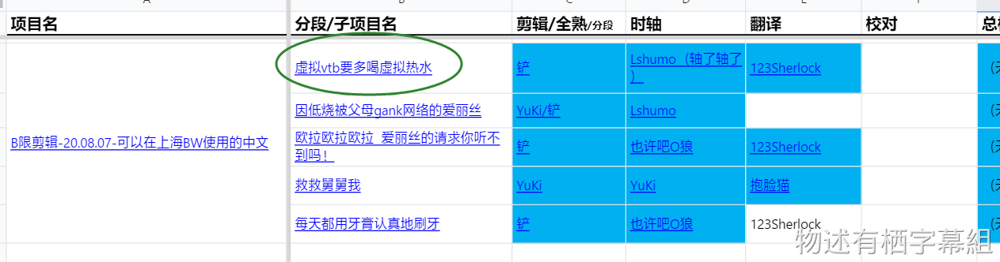
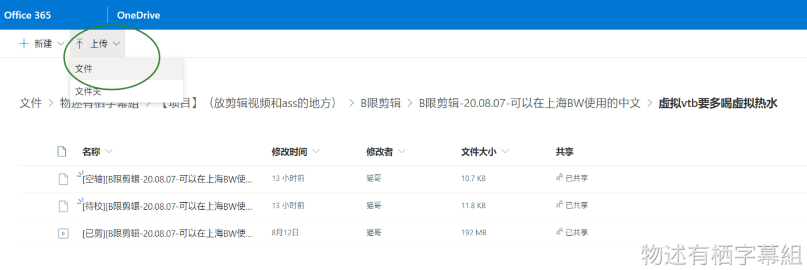
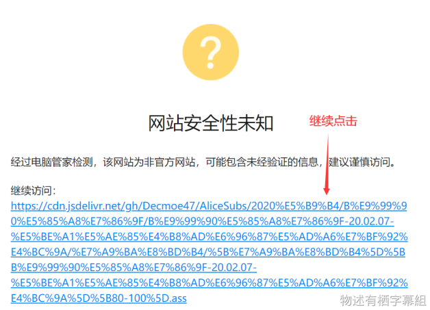
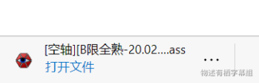
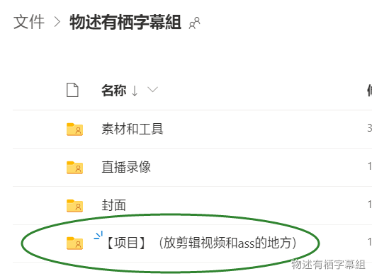
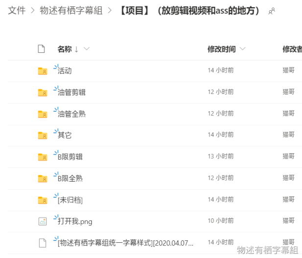
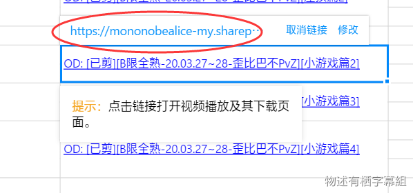
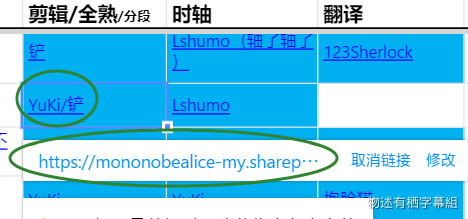

## 字幕文件

本组使用OneDrive作为组内ass文件的共享方式。上传、下载均在OneDrive中。（不再上传到群文件）

### 上传

字幕文件完成后，请在工作表中打开对应的子项目名文件夹，

然后点击“上传”直接上传你的ass。

如果无子项目名的话，就打开项目名文件夹。

之后同理。

### 插下载链接（由杂务完成）

上传完成后，bot会在群内发布上传通知，并附带共享链接（如下）：

将共享链接插入到对应环节的单元格即完成。

无论是文件还是文件夹都要插链接。

此外，覆盖文件时bot也会发布通知（如下）：

这种情况忽视即可，因为覆盖文件不会导致共享链接有变化。

> [!WARNING]
> - 无法访问OD的人可以将ass传到工作群中，会由杂务代传。
> - 如果你是第一个传此项目文件的人，请先创建项目（子项目）文件夹。项目和子项目文件夹请对应工作表。具体步骤请参照剪辑的“[工作流程](/handbook/guideline/clipper.md#工作流程)”或时轴的“[工作流程](/handbook/guideline/timeline.md#工作流程)”。
> - 上传文件到OD后无需告知杂务。**但是，如果上传出现了错误（传错地方、文件名错了、上传失败等），请及时告知杂务。**

### 下载

点击对应人名的链接即可直接下载ass文件。

 
 
 

## 视频文件

本组使用OneDrive作为组内视频文件的共享方式。源文件、剪辑视频文件、压制后视频文件均在此上传和下载。

> [!ATTENTION]
> **原则上所有视频文件都要上传到OneDrive上。如果在群文件或其他地方上上传了的话，请务必在工作表中备注上传了的地方！**

### 上传

上传需要先打开OD总文件夹（需密码，在群置顶公告中），选择【项目】，

 

之后根据工作表中对应的项目名和子项目名放入对应的文件夹中。如果遇到还没有对应的文件夹，请先创建文件夹。

 

> [!TIP]
> - 如果你是第一个传此项目文件的人，请先创建项目（子项目）文件夹。项目和子项目文件夹请对应工作表。具体步骤请参照剪辑的“[工作流程](https://www.yuque.com/decmoe47/qc69ed/brz08z#elmF7)”或时轴的“[工作流程](https://www.yuque.com/decmoe47/qc69ed/dirtlg#o5Aij)”。
> - 上传文件到OD后无需告知杂务。
> - 工作表里的下载链接是由杂务插入的，你无需插入链接（也无法获得正确的链接）。
> - 如果想要订阅文件被上传的通知，请联系杂务。

### 下载
直接从工作表中的“源”列点击链接下载。

现在也可以从工作表的剪辑列点击下载。

